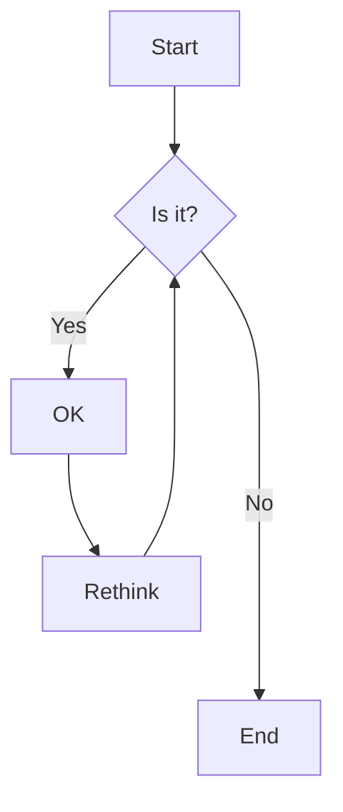

## Bogus Control Flow

what is a control flow?

## control flow flattening

Given that:

- (p1) and (p2) are distinct prime numbers
- (a1) and (a2) are distinct strictly positive random numbers
- (x) and (y) are two variables picked from the program (they have to be reachable from the obfuscation instructions)

$$
p1*(x \vee a_1 )^{2} \ne p2*(y \vee a_2)^{2}
$$

### techniques

### deobfuscation

